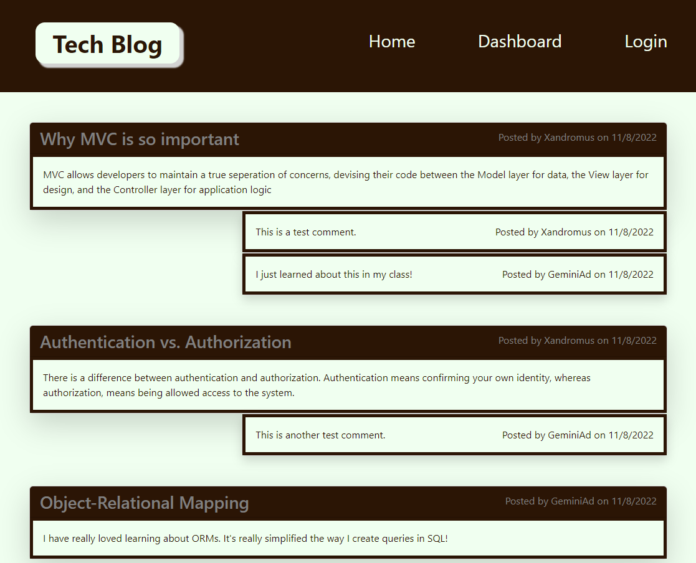
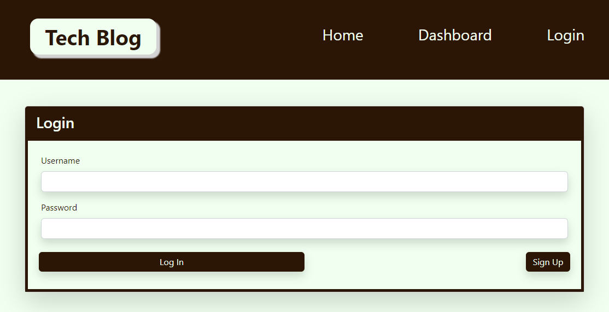

<base target="_blank">

# Tech Blog

<a href="#description">Description</a> •
<a href="#key-features">Key Features</a> •
<a href="#usage">Usage</a> •
<a href="#technologies-used">Technologies Used</a> •
<a href="#concepts-demonstrated">Concepts Demonstrated</a> •
<a href="#credits">Credits</a> •
<a href="#author">Author</a>

---

[Deployed application](https://salty-crag-65332.herokuapp.com/)

---

## Description

This site is a tech blog.

## Key Features

- Log in or sign up with a new account.
- When you navigate away from the page your session information is saved so you don't have to login again.
- When you're idle for a set time period, you are automatically logged out.
- View all blog posts and comments and the date they were created on the home page.
- Create, edit, and delete blog posts.
- Create, edit, and delete comments.

## Usage

When you first visit the home page, all blog posts and their comments are displayed:

If you click on either the dashboard or login nav link, you're taken to a login page where you can either login:

## Technologies Used

- [bcrypt npm package](https://www.npmjs.com/package/bcrypt) for password hashing.
- [Sequelize v6](https://sequelize.org/) for the data modelling.
- [handlebars js](https://handlebarsjs.com/) as a templating engine.
- [node.js](https://nodejs.org/en/) as a server-side javascript runtime environment.
- [Bootstrap v5.2.2](https://getbootstrap.com/) for card and form components, shadow effects, and responsiveness.
- [JavaScript](https://www.javascript.com/)

## Concepts Demonstrated

- Setting up a project using the Model-View-Controller model.
- Using handlebars as the View layer.
- Using Sequelize as the Model layer.
- Using Express.js as the controll layer.
- The use of node.js
- Installing and using node.js packages using npm.
- General JavaScript and programming knowledge.
- Understanding and using CSS Frameworks, such as Bootstrap.
- General HTML/CSS knowledge.

## Credits

Manuel Nunes for a mock-up of the site that I borrowed heavily from.

## Author

Adam Ferro

- [Github](https://github.com/GeminiAd)
- [Linked-In](https://www.linkedin.com/in/adam-ferro)
